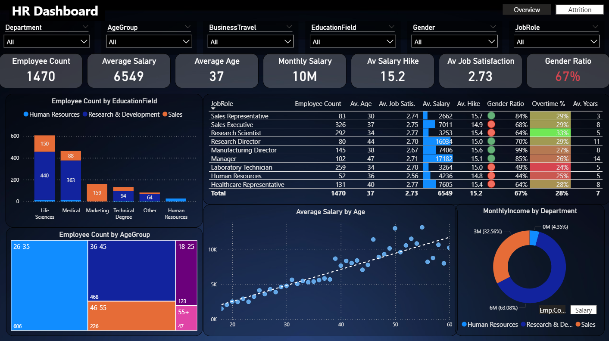
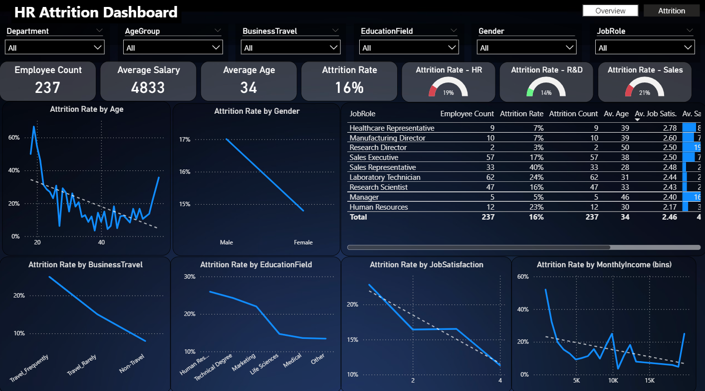

# HR Dashboard | Power BI

## Project Overview

This HR Dashboard was created using Power BI Desktop to analyze employee overview metrics, salary trends, demographics, job satisfaction, and attrition patterns.

The dashboard includes two report pages: an employee overview page and an attrition analysis page. Together, they provide a clear view of workforce composition, compensation patterns, and employee turnover risks.

## Dashboard Preview

### Overview Page

### Attrition Page

## Key Highlights

- Total employees analyzed: 1,470
- Average salary: 6,549
- Average employee age: 37
- Monthly salary total: 10M
- Average salary hike: 15.2
- Average job satisfaction score: 2.73
- Attrition count: 237 employees
- Overall attrition rate: 16%

## Dashboard Insights

- The overview page shows employee distribution across education field, age group, department, job role, and salary.
- Life Sciences and Medical fields have the highest employee counts.
- The 26-35 age group represents the largest employee segment.
- Salary tends to increase with age, based on the salary by age trend.
- The attrition page shows higher attrition among younger employees and selected job roles.
- Sales Representatives show a high attrition rate compared to other roles.
- Business travel, education field, job satisfaction, and monthly income show visible relationships with attrition.

## Business Impact

This dashboard helps HR and management teams:

- Monitor workforce size and employee profile
- Understand salary and job satisfaction patterns
- Identify employee segments with higher attrition risk
- Compare attrition trends across departments, roles, age groups, and education fields
- Support workforce planning, retention strategy, and HR decision-making

## Recommendations

- Review retention strategies for roles with high attrition rates, especially Sales Representatives.
- Investigate attrition patterns among younger employees and lower income groups.
- Monitor job satisfaction scores and identify roles with lower satisfaction levels.
- Review business travel requirements and their relationship with employee turnover.
- Use department and job role filters to identify targeted HR action areas.

## Suggested Actions

- Create role-specific retention plans for high-risk job roles.
- Conduct employee feedback surveys focused on job satisfaction and workload.
- Review compensation and career development opportunities for younger employees.
- Track attrition KPIs monthly to measure changes over time.
- Use the dashboard filters to support deeper HR analysis by department, gender, job role, and age group.

## Tools Used

- Power BI Desktop
- Data Visualization
- HR Analytics
- Attrition Analysis
- Business Intelligence
- Dashboard Design

## Files Included

- `HR_Dashboard_Overview.png` - Overview dashboard preview
- `HR_Dashboard_Attrition.png` - Attrition dashboard preview

## Note

The Power BI `.pbix` file is not included at this stage because the dataset privacy status has not been fully confirmed.

## About This Project

This project was created as part of my data analytics portfolio to demonstrate skills in Power BI dashboard design, KPI reporting, HR analytics, attrition analysis, and business intelligence storytelling.
